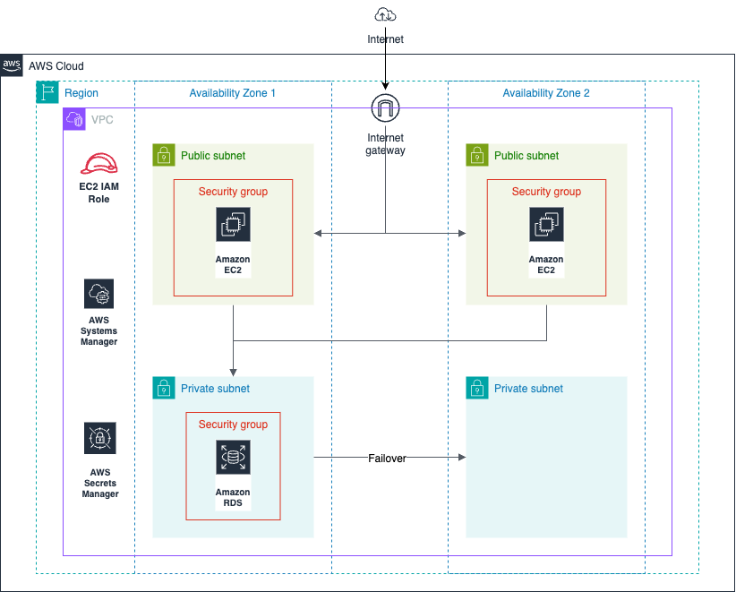
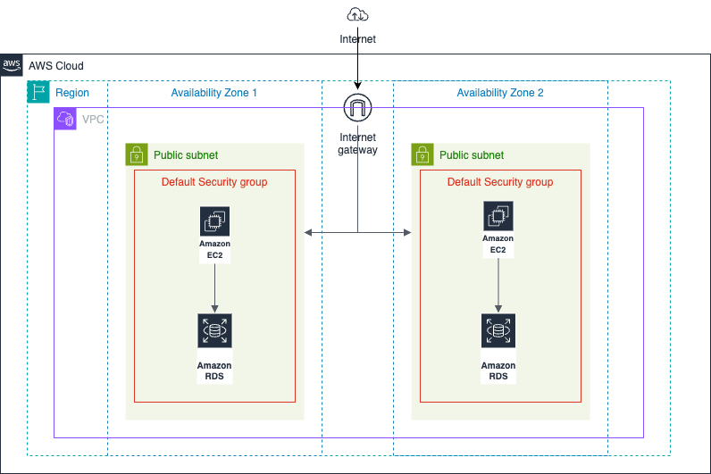

# Manual to IaC - AWS Migration (TechHealth Inc.)

Deliverables:

Access my detailed breakdown on Medium [here](https://medium.com/@gurniksingh/modernizing-aws-infrastructure-with-cdk-a-patient-portal-case-study-8193371a4855).

Updated Architecture:

------------------------------------------------------------------

Project Brief:

You are a Cloud Engineer Consultant working with TechHealth Inc., a healthcare technology company that built their AWS infrastructure manually through the AWS Console 5 years ago. They have a patient portal web application that needs to be modernized and migrated to Infrastructure as Code.

Current Situation

- All infrastructure was created manually via AWS Console
- No version control of infrastructure changes
- Difficult to replicate environments
- Hard to track who made what changes
- No automated testing of infrastructure
- Infrastructure documentation is outdated

Current Infrastructure:

- Web application running on EC2 instances
- MySQL RDS database storing patient data
- Basic VPC setup with all resources in public subnets
- No proper network segmentation
- Manual security group configurations
- Resources spread across multiple availability zones without proper organization

------------------------------------------------------------------

Task:

1. Architecture Design

    - Create an architecture diagram showing:
    - New VPC design with proper public/private subnet structure
    - EC2 placement in public subnet
    - RDS placement in private subnet
    - Security group configurations
    - Network flow between components

2. Infrastructure Migration to CDK

    - Implement the following using AWS CDK with TypeScript:
    - VPC with 2 Availability Zones
    - 1 public subnet per AZ
    - 1 private subnet per AZ
    - Security Groups for EC2 and RDS
    - EC2 instance in public subnet
    - RDS instance in private subnet
    - Necessary IAM roles and policies

3. Testing Requirements

    - Successful EC2 to RDS connectivity
    - Security group configurations working as intended
    - Network isolation is properly configured
    - Infrastructure can be destroyed and recreated consistently

Cost Considerations:

- Use t2.micro for EC2 (free tier eligible)
- Use db.t3.micro for RDS (minimum cost)
- Avoid NAT Gateways (cost-saving measure)
- Remember to destroy resources after testing

AWS Best Practices to Implement:

1. Network Design:

    - Separate public and private subnets
    - Security group least privilege access

2. Security:

    - No direct public access to RDS
    - EC2 instance only accessible via SSH from your IP
    - Database credentials stored securely
    - Use of security groups instead of NACLs where possible